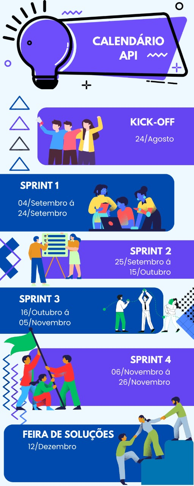
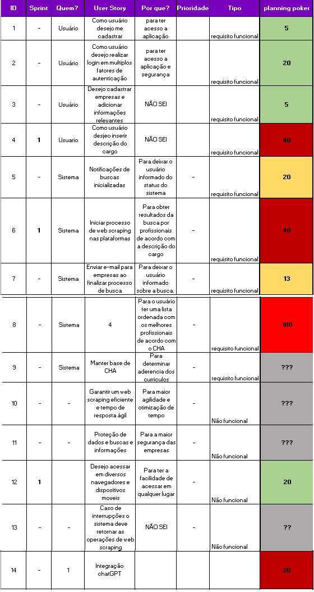

# RecrutaTech

1. [Quem somos nós](#quem-somos-nós)
2. [Sobre a Pro4Tech](#sobre-a-pro4tech)
3. [Cronograma](#cronograma)
4. [Colaboradores](#colaboradores)
5. [Repositórios do projeto](#repositórios-do-projeto)
6. [Documentação](#documentação)
7. [Tecnologias Utilizadas](#tecnologias-utilizadas)

##  Quem somos nós

Somos um grupo de estudantes do 6º Semestre do curso de Análise e Desenvolvimento de Sistemas na Faculdade Tecnológica Prof. Jessen Vidal . Nosso objetivo principal é enfrentar desafios reais no âmbito do Projeto Integrador, desenvolvendo soluções inovadoras.

## Sobre a Pro4Tech

A Pro4Tech é uma empresa especializada em Digital Transformation, dedicada a capacitar negócios para o sucesso na era digital. A empresa combina sua expertise em tecnologias emergentes, como inteligência artificial, análise de dados, IoT e nuvem, juntamente com sua capacidade de desenvolver estratégias personalizadas para cada negócio. O objetivo da Pro4Tech é ampliar a eficiência operacional, aprimorar a experiência do cliente e impulsionar o crescimento. Trabalhando em conjunto, a empresa e seus clientes constroem o futuro digital.

## Objetivo
O objetivo é criar uma aplicação web capaz de identificar os candidatos ideais para vagas específicas, empregando Inteligência Artificial para avaliar o perfil com base nos critérios de Conhecimento, Habilidades e Atitudes (CHA) necessários para a posição.

## Cronograma

## Colaboradores    
| Nome           | Função       | GitHub                                    |
|----------------|--------------|-------------------------------------------|
| Frederico Rabelo | Scrum Master | [fredrbo](https://github.com/fredrbo)    |
| Ana Christina Silva | Product Owner | [AnaChristina](https://github.com/AnaChristina)    |
| Lucas Rafael Andrade Barroso | Desenvolvedor | [lucaszrafael](https://github.com/lucaszrafael)    |
| Debora Faria | Desenvolvedor | [deborafaria01](https://github.com/deborafaria01)    |
| Carlos Henrique Benício Costa | Desenvolvedor | [Carlos-Henrique39](https://github.com/Carlos-Henrique39)    |
| Lucca Santiago Almeida| Desenvolvedor | [LuccaSantiagoDev](https://github.com/LuccaSantiagoDev)    |

## Repositórios do projeto

##### [Front-end](https://github.com/PowerTech5API/Iacit_Frontend_App)

##### [Back-end](https://github.com/Api6-IA/RecrutaTech-FrontEnd)

##### [Raspagem de dados](https://github.com/PowerTech5API/Iacit_Frontend_App)

<!-- ## Backlog -->

## Documentação

#### Backlog

##### [Documento do Projeto](https://github.com/INSERIR_LINK) PENDENTE

## Tecnologias Utilizadas

- **Banco de Dados:** PostgreSQL
- **Back-end:** Java, SpringBoot
- **Front-end:** HTML, CSS, TypeScript, VUE.js, Figma
- **Inteligência Arificial:** Python, INSERIR LIBS
- **Web Scraping:** Python, Beautiful Soup, Selenium

